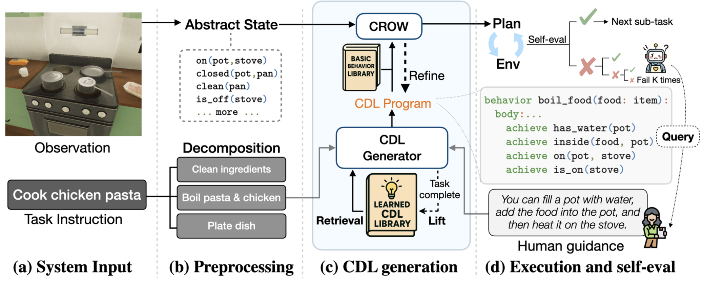
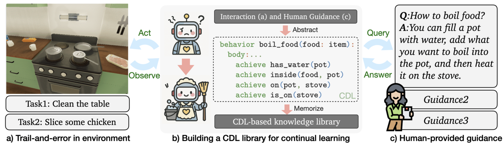

# LEAP: Lifelong Experience Abstraction and Planning

[](https://opensource.org/licenses/MIT)
[](https://www.python.org/downloads/)
[](https://github.com/psf/black)
[](https://icml.cc/)

**LEAP** is a framework for continual behavior learning in embodied agents through interaction with the environment and guidance from humans. LEAP addresses the challenge of representing flexible knowledge about tasks and environments — ranging from constraints and subgoal sequences to action plans and high-level goals — in a unified framework using the Crow Definition Language (CDL).

## 🏗 System Architecture

### LEAP Framework Overview


### Learning and Guidance Mechanisms



## 🌟 Features

- **🧠 CDL-Based Knowledge Representation**: Unified framework using Crow Definition Language that integrates imperative programming with declarative planning
- **📚 Lifelong Learning Library**: Accumulates and refines behavioral repertoire through successful task executions
- **🔄 Continual Behavior Learning**: Abstracts reusable behavior rules from environmental interactions and human guidance
- **🤖 LLM-Powered Translation**: Converts diverse natural language instructions into structured CDL programs
- **🧭 Adaptive Human Guidance**: Reduces dependence on human input over time while leveraging guidance when needed
- **🏠 VirtualHome-HG Benchmark**: 210 diverse tasks across 3 household scenes with human guidance annotations
- **🔍 Retrieval-Augmented Generation**: Uses semantic similarity to retrieve relevant behavior patterns from the library
- **⚡ Self-Evaluation & Refinement**: Automatic error correction and plan refinement mechanisms

## 🚀 Quick Start

### Automated Installation (Recommended)

```bash
git clone https://github.com/George121380/LEAP.git
cd LEAP
./setup.sh
conda activate leap-agent
```

### Verification

```bash
python verify_installation.py
```

### Run Your First Evaluation

```bash
cd src
python main_VH.py --config OursWG --mode single --scene 0 --task_path ../VirtualHome-HG/dataset/Cook_some_food/g1.txt
```

## 🛠 Installation Options

### Option 1: Conda Environment (Recommended)

```bash
git clone https://github.com/George121380/LEAP.git
cd LEAP
conda env create -f environment.yml
conda activate leap-agent
```

### Option 2: pip Installation

```bash
git clone https://github.com/George121380/LEAP.git
cd LEAP
pip install -r requirements.txt
# Manual setup of third-party libraries required (see below)
```

### Third-Party Dependencies

The project requires two external libraries:

```bash
# Create directory for third-party libraries
mkdir -p ~/leap_third_party
cd ~/leap_third_party

# Install Jacinle
git clone https://github.com/vacancy/Jacinle --recursive

# Install Concepts
git clone https://github.com/vacancy/Concepts --recursive

# Set environment variables
export PATH="~/leap_third_party/Jacinle/bin:$PATH"
export PYTHONPATH="~/leap_third_party/Jacinle:$PYTHONPATH"
export PATH="~/leap_third_party/Concepts/bin:$PATH"
export PYTHONPATH="~/leap_third_party/Concepts:$PYTHONPATH"
```

## ⚙️ Configuration

### API Keys Setup

1. Copy the example configuration:
   ```bash
   cp config/api_keys.json.example config/api_keys.json
   ```

2. Edit `config/api_keys.json` with your actual API keys:
   ```json
   {
     "OpenAI_API_Key": "sk-your-actual-openai-key",
     "Deepseek_API_Key": "your-actual-deepseek-key"
   }
   ```

### Agent Configurations

| Configuration | Description |
|---------------|-------------|
| **OursWG** | Full system with guidance (recommended) |
| **OursWOG** | Full system without guidance |
| **LLMWG** | LLM baseline with guidance |
| **LLMWOG** | LLM baseline without guidance |
| **LLMPlusPWG** | LLM with planning, with guidance |
| **CAPWG** | CAP baseline with guidance |

### Ablation Study Configurations

| Configuration | Purpose |
|---------------|---------|
| **WOLibrary** | Without behavior library |
| **ActionLibrary** | Action-based vs behavior-based library |
| **WORefinement** | Without goal refinement |
| **WOSplit** | Without task decomposition |
| **PvP** | Policy vs Planning comparison |

## 🏠 VirtualHome-HG Benchmark

LEAP introduces **VirtualHome-HG (Human Guidance)**, a new benchmark built on the VirtualHome simulator featuring:

### 📊 Dataset Statistics
- **210 diverse tasks** across 3 different household scenes
- **93 cooking tasks**, 33 cleaning tasks, 27 laundry tasks, 57 rearrangement tasks
- **376 distinct items** spanning 157 categories per scene on average
- **Task complexity**: From single-action tasks to complex 159-action sequences

### 🎯 Task Categories
- **Simple Set (78 tasks)**: Single-stage tasks requiring <15 actions
- **Multi-stage Set (30 tasks)**: Complex tasks requiring 30-150 actions
- **Ambiguous Set (57 tasks)**: Tasks with highly ambiguous descriptions requiring human guidance
- **Constraint Set (30 tasks)**: Tasks with implicit size and spatial constraints

### 📏 Evaluation Metrics
- **Task Completion Rate**: Based on goal state achievement using oracle planning
- **Key Action Execution Rate**: Measures execution of manually annotated critical actions
- **Combined Score**: Weighted combination (2/3 action rate + 1/3 goal rate)

### 🤖 Human Guidance System
- **LLM-based Human Agent**: Provides natural, human-like guidance based on annotated instructions
- **Adaptive Querying**: Agents can request help after multiple failed attempts
- **Realistic Communication**: Mimics parent-child teaching interactions without robotic terminology

## 📖 Usage

### Interactive Mode

```bash
cd src
python main_VH.py
```

Follow the prompts to:
1. Select agent configuration
2. Choose evaluation mode (single task or batch)
3. Specify scenes and parameters

### Command Line Interface

```bash
# Single task evaluation
python main_VH.py --config OursWG --mode single --scene 0 \
  --task_path ../VirtualHome-HG/dataset/Cook_some_food/g1.txt

# Batch evaluation
python main_VH.py --config OursWG --mode all --run_mode test --scene all

# Cooking-specific tasks
python main_cooking.py
```

### Available Command Line Options

```
--config CONFIG         Agent configuration (e.g., OursWG, LLMWG)
--mode {single,all}     Evaluation mode
--scene SCENE           Scene ID or 'all' for all scenes
--task_path TASK_PATH   Path to specific task file (single mode)
--run_mode {debug,test} Running mode for batch evaluation
--checkpoint PATH       Resume from checkpoint
--verbo                 Verbose output
```

## 🏗 Project Structure

```
LEAP/
├── 📁 src/                     # Source code
│   ├── 🤖 agent/               # Agent implementations
│   │   ├── base.py             # Base agent class
│   │   ├── leap.py             # LEAP agent (main)
│   │   └── llm_based.py        # LLM-only agent
│   ├── 📊 evaluation.py        # Task evaluation logic
│   ├── 🏠 env.py               # VirtualHome environment wrapper
│   ├── 🧠 planning.py          # Planning pipeline
│   ├── 📚 library.py           # Behavior library
│   ├── 👤 human.py             # Human guidance interface
│   ├── ⚙️ configs.py           # Configuration classes
│   ├── 📁 prompts/             # LLM prompts and templates
│   ├── 📁 simulator/           # VirtualHome simulator components
│   └── 📁 utils/               # Utility functions and models
├── 📁 VirtualHome-HG/          # Dataset and scenes
│   ├── 📁 dataset/             # Task definitions
│   └── 📁 scenes/              # Environment scenes
├── 📁 config/                  # Configuration files
├── 🐍 environment.yml          # Conda environment
├── 📦 requirements.txt         # Python dependencies
├── 🔧 setup.sh                 # Automated setup script
└── ✅ verify_installation.py   # Installation verification
```

## 🧪 Key Components

### Agent Architecture

- **🧠 Planning Agent**: Uses formal planning with CDL goal representations
- **🎯 Policy Agent**: Direct action selection based on current state  
- **💭 LLM Agent**: Pure language model-based decision making

### Behavior Library

The system maintains a library of successful behaviors:
- **Behavior-based storage**: Formal CDL representations
- **Action-based storage**: Sequential action patterns
- **RAG retrieval**: Semantic similarity-based behavior matching

### Human Guidance

- **🤖 LLM Guidance**: Automated assistance using language models
- **👤 Manual Guidance**: Interactive human input during execution
- **🔄 Loop Feedback**: Iterative refinement based on execution results

## 🔑 Key Contributions

1. **🧠 LLM-to-CDL Translation**: Novel algorithm that translates diverse natural language instructions into structured CDL behavior representations with task decomposition and error correction mechanisms

2. **📚 Continual Behavior Learning**: Mechanism for abstracting and storing reusable behavior rules that enables lifelong learning and knowledge accumulation in embodied agents

3. **🏠 VirtualHome-HG Benchmark**: Comprehensive evaluation dataset with 210 challenging long-horizon tasks across 3 household environments, featuring systematic human-in-the-loop evaluation

## 📈 Experimental Results

LEAP demonstrates significant improvements over baseline methods:

### Performance Comparison (Overall Success Rate)
| Method | Without Guidance | With Guidance |
|--------|------------------|---------------|
| LLM Policy | 59.1% | 59.3% |
| LLM+P | 67.8% | 70.1% |
| Code as Policy | 61.7% | 69.9% |
| Voyager | 70.1% | 76.4% |
| **LEAP (Ours)** | **75.6%** | **80.1%** |

### Key Findings
- **🎯 Best Human Guidance Utilization**: LEAP achieves the highest improvement (14.3%) on ambiguous tasks when receiving human guidance
- **📚 Library Learning Benefits**: CDL library storage significantly outperforms action sequence storage across all task categories
- **🔄 Continual Learning**: Performance continuously improves over time, with 12% improvement on medium tasks and 17% on hard tasks through prior experience
- **⚡ Efficiency**: Refinement mechanism reduces CDL generation time by ~10% while improving performance

## 📊 Evaluation Metrics

The framework provides comprehensive evaluation across multiple dimensions:

- **Task Completion Rate**: Percentage of successfully completed tasks
- **Action Efficiency**: Number of actions required vs optimal
- **Library Usage**: Effectiveness of behavior reuse
- **Guidance Dependency**: Reliance on human assistance
- **Cross-scene Generalization**: Performance across different environments
- **Error Analysis**: Detailed failure mode categorization

Results are automatically logged in CSV format for analysis.

## 📚 Citation

If you use this work in your research, please cite:

```bibtex
@inproceedings{liu2025leap,
  title={Lifelong Experience Abstraction and Planning},
  author={Peiqi Liu and Joshua B. Tenenbaum and Leslie Pack Kaelbling and Jiayuan Mao},
  booktitle={ICML 2025 Workshop on Programmatic Representations for Agent Learning},
  year={2025},
  institution={Massachusetts Institute of Technology and EECS, Peking University}
}
```

## 📄 License

This project is licensed under the MIT License - see the [LICENSE](LICENSE) file for details.

## 🙏 Acknowledgments

- **VirtualHome**: Built upon the VirtualHome simulator (Puig et al., 2018) for realistic household environments
- **Crow Definition Language (CDL)**: Leverages CDL (Mao et al., 2024) as the core behavior rule language
- **MIT & PKU**: Research conducted at Massachusetts Institute of Technology and Peking University
- **ICML 2025**: Accepted at ICML 2025 Workshop on Programmatic Representations for Agent Learning
- **Jacinle & Concepts**: Utilizes frameworks by Jiayuan Mao for reasoning and planning

## 🔗 Related Work

- **VirtualHome**: [Original VirtualHome Environment](https://github.com/xavierpuigf/virtualhome)
- **Crow Planner**: [CDL and Crow Planning Framework](https://github.com/concepts-ai/Concepts)
- **Embodied AI**: This work contributes to the broader field of embodied AI and continual learning

---

**⭐ Star this repository if you find it helpful!**

For questions and discussions, please open an issue or reach out to the maintainers.